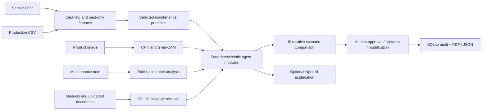

# AI Factory Command Center

A hackathon prototype for a bearing production line: combine sensor predictions, product images, production quality records, maintenance notes and manuals into a human-reviewed incident. All included factory data and manuals are synthetic. This is decision support, not a machine controller.

## Run locally

From this project folder in PowerShell, with Python and internet access for package installation:

```powershell
python -m venv .venv
.\.venv\Scripts\Activate.ps1
python -m pip install -r requirements-tested.txt
python train.py
python -m streamlit run app.py
```

If activation is unavailable, use `.\.venv\Scripts\python.exe` instead of `python`. Training generates datasets, trains the models and writes artifacts; rerunning it overwrites generated datasets and current local model files and adds MLflow runs. CPU training time depends on the computer. The exact tested direct-package versions are recorded in requirements-tested.txt; use that file to reproduce the trained artifact environment.

This workspace may also contain a project-local `.deps` dependency fallback for an existing Python environment. `app.py` and `train.py` add it to their import search path. When launching Streamlit directly from such an environment:

```powershell
$env:PYTHONPATH = "$PWD\.deps"
python -m streamlit run app.py
```

A clean virtual environment is preferable when reproducing the project elsewhere. In a second terminal, launch the local experiment viewer:

```powershell
python tools/mlflow_ui.py
```

Use the local URL printed by each command (Streamlit normally uses port 8501; MLflow uses port 5000). Check the workflow and data tests with `python -m pytest tests`. The local suite passed 17 tests, including Streamlit analysis and rejection. Browser verification and PDF checks were also performed. Hosted LLM generation remains blocked by the supplied API account credit balance. Local Qwen weights are installed on this computer and actual generation has been verified.

## Demonstration flow

1. Choose a machine, historical observation and normal or defective demo image.
2. Enter a maintenance note; optionally upload additional TXT or text-based PDF guidance.
3. Click **Analyze incident**. Inspect failure probability, image classification, scenario costs and the saved incident snapshot.
4. Open **Evidence & agents** for local feature sensitivity, Grad-CAM, retrieved passages and four structured agent messages.
5. Optionally click **Generate LLM explanation** after configuring an API key.
6. Approve, reject or modify the recommendation. Modification requires an action and reason. Download the PDF and evidence JSON.
7. Open **Models & data** and MLflow to explain validation, selection and errors.

Changing inputs does not change an already analyzed incident until Analyze is clicked again. Decisions are stored locally; they do not operate equipment. The Controlled learning tab separately accepts confirmed outcomes and can train a candidate on eligible new observations. It never promotes a candidate automatically.

## Architecture



The five input categories are numerical sensor time series, tabular production records, images, free-text maintenance notes and document knowledge. These are five business data modalities, not five separate neural encoders. Generated maintenance notes are available as a CSV; the UI analyzes text entered in its note field.

The maintenance, vision, knowledge and planner agents exchange structured dictionaries in a deterministic pipeline. They are modular agents in the software sense; they are not independent LLM agents, autonomous tool users or a framework-based agent team. Retrieval uses paragraph TF-IDF and cosine similarity, returning up to three positive matches with sources. The selected local or hosted language model combines retrieved passages with the incident, forming the generation stage of RAG. Local Qwen is installed and verified without API credentials. If generation is unavailable, fallback text is labelled and never counted as a generated answer.

## Optional external API

All training, inference, retrieval, simulation, decisions and reports run locally. Hosted generation needs your own OpenAI API key, network access and access to the model entered in the sidebar (default `gpt-4o-mini`). You can enter the key in the password field or set `OPENAI_API_KEY` in your environment. Do not commit credentials. The explicit generation button sends the incident and retrieved text to OpenAI; use suitable demo material. Errors produce a labelled offline summary instead of claiming a generated answer. API access and usage costs are separate from this project.

Retrieved text is supplied as untrusted evidence in the LLM instruction; source-grounded prompting is not a guarantee against hallucinations or prompt injection. Review the answer and citations.

## Uploaded CSV schema

Sensor CSV requires these columns:

| Column | Meaning |
|---|---|
| `machine_id` | Machine identifier, such as `M-01` |
| `timestamp` | Parseable timestamp; converted to UTC |
| `temperature` | Degrees Celsius; accepted range -20 to 180 |
| `vibration` | mm/s; accepted range 0 to 30 |
| `pressure` | bar; accepted range 0 to 20 |
| `rpm` | Rotations/minute; accepted range 0 to 10000 |
| `load` | Fraction from 0 to 1 |

`failure_next_6h` is the synthetic training target; it is not required for inference uploads. The optional production CSV requires `machine_id,timestamp,units,rejects`; records join on machine and exact timestamp. Valid rejection rates require positive units and `0 <= rejects <= units`.

Invalid timestamps and missing machine identifiers are removed. Duplicate machine/timestamp records keep the first occurrence. Invalid sensor ranges become missing values. Forward fill stays within each machine and uses only prior readings. Rolling features use six observations, which correspond to six hours only for the hourly demo data. Remaining gaps use training-fit median imputation. A missing production rate is imputed for model inference; the twin uses an explicitly labelled 5% assumption when production quality is unavailable. Uploaded data does not trigger retraining.

PNG/JPEG uploads are accepted by the UI but the CNN was trained only on generated 64×64 bearing drawings. Real camera photographs are outside its validated domain. PDF extraction handles embedded text, not scanned-page OCR. Uploads are capped at 25 MB; document extraction reads at most 50 PDF pages and 200,000 characters per analysis.

## Models and evaluation

Training compares logistic regression, Random Forest and a small PyTorch ANN for six-hour failure prediction. A separate CNN classifies synthetic surface defects. Maintenance data uses chronological 60/20/20 boundaries, with a six-hour purge before validation and test so future target windows do not cross split boundaries. Preprocessors fit on training data. Neural checkpoints use validation loss; the maintenance model is selected by validation F1 at threshold 0.5. Test results are reported after selection, not used for choosing the maintenance model.

See `artifacts/metrics.csv` for the actual precision, recall, F1 and ROC-AUC values after training. Do not compare CNN scores directly with maintenance-model scores: they measure different tasks. All splits come from the same synthetic generator and the same simulated fleet; none proves performance on a real or unseen factory. Probabilities are not calibrated confidence intervals.

Local sensor explanations replace one input at a time with its training median; this is sensitivity analysis, not causal attribution or SHAP. Global Random Forest permutation importance is separate. Grad-CAM highlights influential image regions; it is not a defect segmentation mask.

## Digital twin assumptions

The twin is an expected-cost scenario calculator, not a calibrated physical simulator. It converts six-hour failure probability `p` to the chosen horizon using `1-(1-p)**(hours/6)`, a hypothetical constant-hazard assumption. Default horizon: eight hours, 120 units/hour; failure downtime: four hours, capped by available time; repair: 2400 illustrative currency units; lost unit: 4. Reduced load uses 70% throughput and a 0.55 risk multiplier. Maintenance takes two hours, costs 450 and uses a 0.15 risk multiplier.

Production rejection rate supplies yield loss and is held constant across actions. An individual image defect score never becomes a batch reject rate. A flagged image adds a supervisor quality-review requirement. The lowest simulated expected cost supplies the suggested action; human review must consider the unsupported assumptions and real procedures.

## Output evidence

| Location | Contents |
|---|---|
| `data/` | Generated sensor, production and note CSVs; image splits; synthetic manuals |
| `artifacts/metrics.csv` | Validation/test metrics per model and task |
| `artifacts/preprocessing.json` | Cleaning audit, split counts and purge |
| `artifacts/cleaned_data.csv`, `eda_summary.csv` | Cleaned observations and numeric summary |
| `artifacts/maintenance.joblib`, `ann.pt`, `cnn.pt` | Local trained predictors / weights |
| `artifacts/selected_model.json` | Validation-based selection and registry metadata |
| `artifacts/feature_importance.csv` | Global Random Forest permutation importance |
| `artifacts/maintenance_errors.csv`, `confusion_matrix.json` | Maintenance error evidence |
| `artifacts/image_predictions.csv` | Held-out image predictions and error flags |
| `artifacts/mlflow.db` | Local experiment tracking database |
| `artifacts/decisions.sqlite` | Human decisions and full incident snapshots |

MLflow records model experiments and registers the selected maintenance predictor as `FactoryMaintenance`. The app loads its local bundle; it does not fetch a live registry alias on every prediction. PDF/JSON downloads are created from the analyzed incident and current decision. Human feedback is an audit record, not an automatically verified training label.

See `docs/demo-script.md` for the presentation walkthrough and `docs/rubric-checklist.md` for implementation evidence and gaps.

## Included submission files

outputs/presentation.html is a 12-slide browser presentation with arrow-key navigation; outputs/presentation.pdf is the printable deck. outputs/sample-incident.pdf is an example pending report. outputs/synthetic-manual.pdf can be uploaded in the app to demonstrate PDF extraction. outputs/grad-cam.png and dashboard screenshots provide visual evidence. See docs/demo-script.md for the narration.

The selected Random Forest test F1 is 0.8585; ANN test F1 is 0.8517 and CNN test F1 is 0.9873. These describe held-out synthetic samples.

When the folder is moved, tools/mlflow_ui.py updates stored local MLflow artifact locations using tools/relocate_mlflow.py. Keep mlruns/ alongside artifacts/. Before committing newly generated MLflow runs, `python tools/sanitize_mlflow.py` converts database locations to portable paths. The application loads only its bundled local models.

## Controlled continuous learning

The **Controlled learning** tab records the observed six-hour outcome separately from the supervisor decision. It requires an existing audit decision, the full observation horizon and an evidence note. Each incident has one immutable outcome record. Maintenance, reduced-load and unknown interventions are excluded from candidate training because their outcomes may be altered by the intervention.

Candidate training requires at least 60 unique observations newer than the original dataset, with both classes in chronological training, validation and test partitions. Six-hour purge gaps avoid target overlap. Candidate training combines the original training split with new training observations, compares against the active predictor on new validation/test observations and logs/registers `FactoryMaintenanceCandidate` in MLflow. The review gate requires validation F1 >= 0.65, recall >= 0.70 and no regression against the active model. No candidate replaces the app's active model.

Run `python tools/demo_learning.py` for an independent synthetic rehearsal. It uses a separate audit database, simulated supervisor events and synthetic future outcomes, never the live human audit. Its changed cohort exposes model weakness: the candidate fails the minimum quality gate and is withheld. See outputs/controlled-learning-evidence.json. These are useful rejection-path results, not evidence that retraining improved performance.

## GenAI without paid API credits

The sidebar offers **Local Qwen (no API credits)** using [Qwen2.5-0.5B-Instruct](https://huggingface.co/Qwen/Qwen2.5-0.5B-Instruct), an Apache-2.0 model. Install `requirements-local-llm.txt`, then run `python tools/setup_local_llm.py` to download roughly 1 GB of weights into local_models/. Once installed, inference stays local and does not download files or send incident data externally. The small model's claims still require source checking.

The model download completed after a rate-limit pause. Three genuine local generations were verified. In the saved comparison, retrieval produced the correct 70% throughput and 0.55 multiplier; without retrieval the model invented 5% and 1.4. This demonstrates the value of retrieval for one case, not universal accuracy. See outputs/local-genai-evidence.json, including its candid manual review. OpenAI remains an optional provider requiring API credits.

## Rehearsal evidence

`python tools/rehearse.py` exercises actual model inference with normal/defective images and all three supervisor decisions, then verifies report text. Generated rehearsal PDFs and JSON are clearly labelled as simulated supervisor events. The original dataset, trained models and active model version are preserved during controlled-learning rehearsal.

Local-model revision: 7ae557604adf67be50417f59c2c2f167def9a775. Installed weights are not included in the submission ZIP; setup instructions and the source/license manifest are included.
